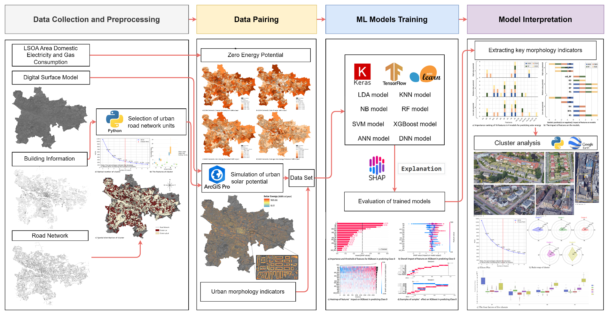

# Glasgow dataset

**Chen Yang, Senhong Cai, Zhonghua Gou\***
_School of Urban Design, Wuhan University, Wuhan, China;_  
_\*correspondence: zh.gou@whu.edu.cn_
## Abstract

The complexity of urban form can have a significant impact on the utilization of solar energy. While numerous studies have examined the influence of urban form on solar potential, the optimization of solar energy use in cities located at high latitudes remains a challenging subject.

In this study, we focus on the high-latitude city of Glasgow, using residential buildings in urban grid cells as our sample. We calculate solar potential and urban form metrics for these buildings using the Digimap database and the ArcGIS Pro platform.

Employing eight machine learning algorithms, we analyze the data and extract eight key morphological indicators that affect the solar potential of urban grid cells. Among these indicators, we select four metrics — roof slope, building density, plot ratio, and building perimeter shape factor — for cluster analysis, enabling us to classify urban building forms into five types based on their characteristics and solar potential.

Our calculations demonstrate that effective utilization of solar energy offers significant zero energy potential for Glasgow. The primary scientific contribution of this study lies in bridging the knowledge gap concerning the optimization of solar energy use in high-latitude areas.

The findings of this research can provide valuable guidance in the early stages of urban planning and design, assisting policymakers in rationalizing the use of solar energy resources for sustainable urban development. Furthermore, the results help urban stakeholders identify variations in the solar potential of different building forms, aiding them in selecting appropriate building types and zones to maximize solar energy utilization.

### Keywords
- Urban solar potential
- Urban morphology
- Machine learning algorithms
- High latitude area
- Urban design

